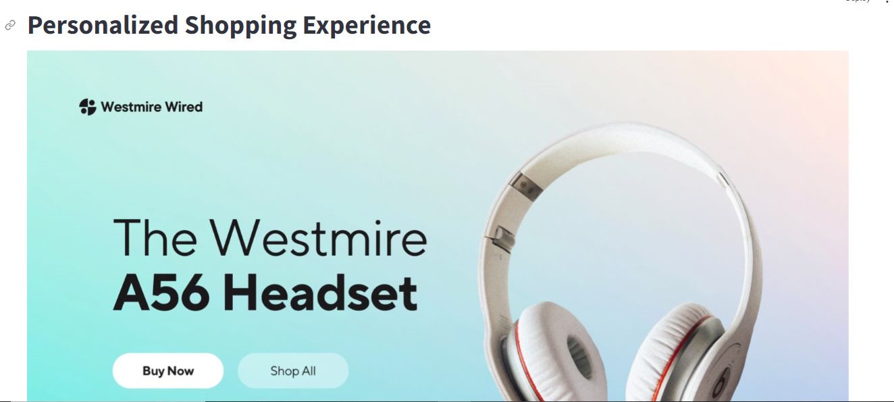
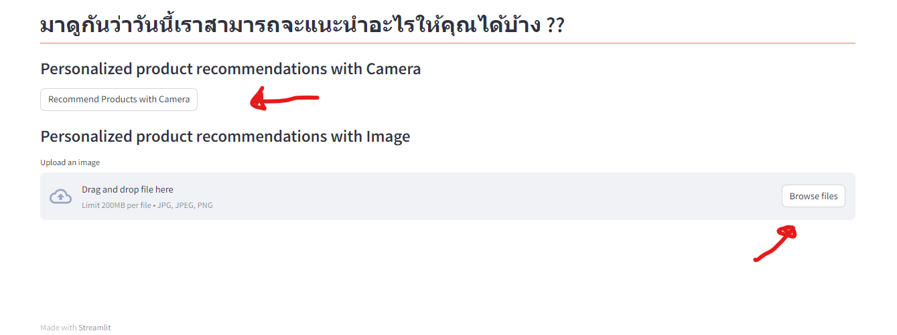

# Personalized-Shopping-Experience-with-face-recognition

### วิธีใช้งาน

1. ทำการเปิด cmd แล้วเข้าถึงโฟล์เดอร์ที่จะเก็บโปรเจ็ค Ex: cd 'path/to/your/directory'
2. git clone https://github.com/alexday11/Personalized-Shopping-Experience-with-face-recognition.git
3. cd 'Personalized-Shopping-Experience-with-face-recognition'
4. cd 'pip install -r requirements.txt'
5. เข้าไปที่โฟลเดอร์ Dataset ทำการแตกไฟล์ dataset_amazom.zip
6. โฟลเดอร์ Image มีไฟล์ 10classes.zip ให้ทำการแตกไฟล์เพื่อลองใช้รูปภาพในการทดสอบแอป
7. กลับมาที่ cmd แล้วสามารถเริ่มแอปโดยการใช้คำสั่ง streamlit run app.py

### ตัวอย่าง

